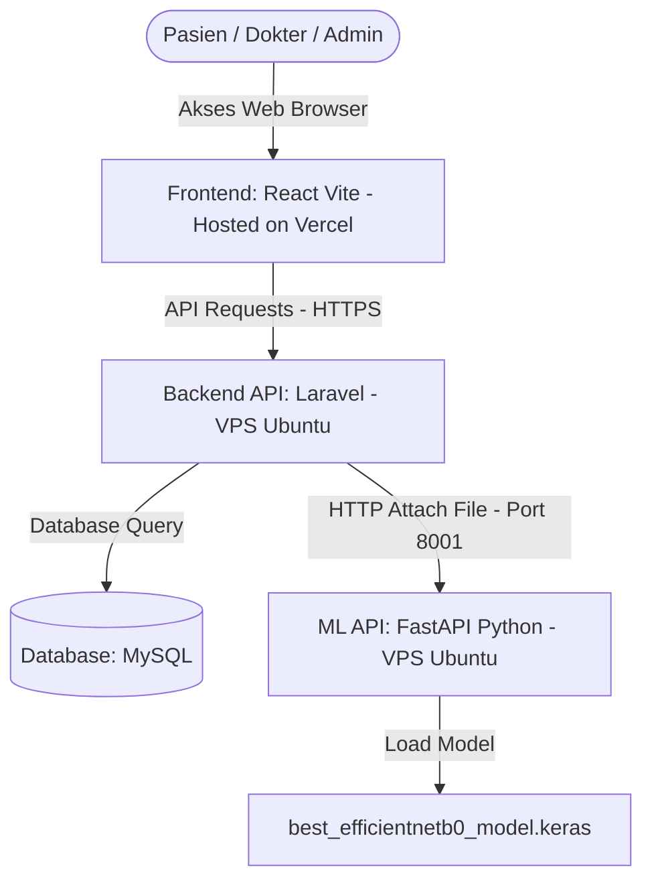

# Panduan Serah Terima (Handover Guide) Sistem SIGIGI 2.0

Dokumen ini disusun sebagai panduan teknis bagi tim pengembang (*developer*), administrator sistem (*system administrator*), atau perwakilan teknologi informasi (TI) dari pihak **Mitra Klinik** untuk menerima penyerahan sistem **SIGIGI 2.0**.

---

## 1. Ringkasan Arsitektur Sistem

Sistem SIGIGI 2.0 dibangun menggunakan arsitektur modular yang memisahkan frontend, backend API, dan microservice Machine Learning:



*   **Frontend**: Aplikasi SPA berbasis React, Vite, dan TypeScript. Di-host pada **Vercel** (menggunakan domain publik).
*   **Backend API**: Aplikasi API berbasis Laravel 11. Di-host pada **VPS Ubuntu** menggunakan web server Nginx.
*   **Machine Learning API**: Microservice Python FastAPI untuk mendeteksi karies gigi. Berjalan di background VPS menggunakan systemd service pada port `8001`.

---

## 2. Daftar Aset yang Diserahkan

Seluruh aset di bawah ini diserahkan dalam bentuk repositori Git atau berkas terkompresi (`.zip`):

| Nama Aset | Deskripsi / Isi | Jalur Berkas / Direktori |
| :--- | :--- | :--- |
| **Frontend Code** | Kode antarmuka pengguna (React) | `frontend/` |
| **Backend Code** | Kode logika bisnis & API (Laravel) | `backend-api/` |
| **ML API Code** | Kode microservice deteksi karies (Python) | `ml-api/` |
| **Model AI** | Berkas model EfficientNetB0 yang sudah terlatih | `best_efficientnetb0_model.keras` |
| **Database Schema** | Dump database MySQL (tabel & data awal) | `sigigi.sql` |
| **Manual Book** | Panduan operasional pengguna (Admin, Dokter, Pasien) | `Manual_Book_SIGIGI_2.0_REVISED.docx` |
| **Panduan Teknis** | Panduan instalasi dan deployment sistem | `DEPLOYMENT_GUIDE.md` & `RUN_GUIDE.md` |
| **Laporan Audit** | Laporan audit keamanan dan performa sistem final | `audit_report.md` |

---

## 3. Langkah Migrasi & Transfer Kepemilikan Akun

Agar sistem tetap berjalan secara mandiri dan di bawah kendali penuh Mitra Klinik, lakukan langkah migrasi berikut:

### 3.1. Transfer VPS (IDCloudHost)
Jika VPS saat ini menggunakan akun pribadi pengembang, kepemilikan Virtual Machine (VM) dapat dipindahkan tanpa mematikan server:
1.  Minta pihak IT Mitra Klinik membuat akun di **[Console IDCloudHost](https://console.idcloudhost.com/)** dan melakukan top-up saldo billing.
2.  Dapatkan **Email Akun** console milik Mitra Klinik.
3.  Login ke akun Console IDCloudHost Anda, buka detail VM SIGIGI, pilih tab **Setting** / **Transfer Ownership**.
4.  Masukkan email akun Mitra Klinik dan kirim permintaan transfer. Pihak Mitra tinggal menyetujui (*accept*) di console mereka.

### 3.2. Transfer Akun Hosting Frontend (Vercel)
Untuk memindahkan hosting React di Vercel:
1.  Minta pihak Mitra Klinik membuat akun Vercel (disarankan menggunakan opsi login via GitHub).
2.  Buka dashboard proyek SIGIGI di Vercel Anda, masuk ke **Settings** -> **Members** -> **Invite Member** (masukkan email Mitra Klinik).
3.  Setelah pihak Mitra bergabung, jadikan mereka sebagai **Owner** tim/proyek, kemudian hapus akun Anda dari proyek tersebut.

### 3.3. Transfer Project Google Cloud Console (Google OAuth)
Sistem menggunakan Login Google yang terikat pada *OAuth Client ID* di Google Cloud Console:
1.  Buka **[Google Cloud Console](https://console.cloud.google.com/)**.
2.  Pilih proyek Google Cloud yang digunakan oleh SIGIGI.
3.  Buka menu **IAM & Admin** -> **IAM**.
4.  Klik **Grant Access**, masukkan email Google milik perwakilan TI Mitra Klinik, dan berikan peran (*role*) sebagai **Owner**.
5.  Setelah mereka menerima, mereka dapat menghapus akses email Anda dari proyek tersebut.

### 3.4. Transfer Domain & DNS (Registrar)
Arahkan kepemilikan domain/subdomain web (misal `sigigi.com` dan `api.sigigi.com`):
*   Pindahkan akun registrar domain ke email Mitra Klinik, atau
*   Ubah Nameservers (NS) domain ke Cloudflare milik Mitra Klinik agar mereka dapat mengelola record DNS (A Record untuk VPS, CNAME untuk Vercel) secara mandiri.

---

## 4. Konfigurasi Kredensial & Lingkungan (`.env`)

Pastikan berkas konfigurasi `.env` pada server produksi telah disesuaikan dengan kredensial baru milik Mitra Klinik.

### 4.1. Konfigurasi `.env` Backend Laravel (VPS: `/var/www/sigigi-backend/.env`)
```env
APP_NAME=SIGIGI
APP_ENV=production
APP_KEY=base64:xxx...   # Generate menggunakan 'php artisan key:generate'
APP_DEBUG=false
APP_URL=https://api.domain-mitra.com

# Database Connection
DB_CONNECTION=mysql
DB_HOST=127.0.0.1
DB_PORT=3306
DB_DATABASE=sigigi
DB_USERNAME=sigigi_user
DB_PASSWORD=Password_Baru_Milik_Mitra

# Machine Learning API Port Connection
ML_API_URL=http://127.0.0.1:8001/predict

# Google Authentication credentials for Portal
GOOGLE_CLIENT_ID=Client_ID_Baru_Dari_Google_Console_Mitra
GOOGLE_CLIENT_SECRET=Client_Secret_Baru_Dari_Google_Console_Mitra
```

### 4.2. Konfigurasi Environment Variables Frontend (Vercel Console)
Sesuaikan variabel lingkungan pada dashboard proyek Vercel milik Mitra:
*   `VITE_API_URL`: `https://api.domain-mitra.com` (Alamat subdomain backend API yang aman dengan HTTPS).
*   `VITE_GOOGLE_CLIENT_ID`: `Client_ID_Baru_Dari_Google_Console_Mitra` (Agar pencocokan token login Google di sisi client sinkron).

---

## 5. Prosedur Keamanan Pasca-Serah Terima (Wajib)

Demi keamanan integritas data pasien di klinik, perwakilan IT Mitra **WAJIB** melakukan langkah-langkah berikut segera setelah serah terima selesai:

1.  **Ganti Password Root VPS**:
    Masuk ke terminal SSH VPS dan jalankan perintah:
    ```bash
    passwd root
    ```
    Masukkan password baru yang kuat dan catat dengan aman.
2.  **Ganti Password User Database MySQL**:
    Ubah password user database `sigigi_user` di MySQL dan perbarui nilai `DB_PASSWORD` di berkas `.env` Laravel.
3.  **Ganti Password Akun Admin Aplikasi**:
    Masuk ke dashboard admin menggunakan akun default, lalu segera ubah password akun administrator bawaan melalui menu Pengaturan Pengguna.
4.  **Verifikasi SSL (HTTPS) Certbot**:
    Pastikan sertifikat SSL Let's Encrypt aktif untuk subdomain API VPS Anda dengan menjalankan perintah:
    ```bash
    sudo certbot renew --dry-run
    ```

---

## 6. Referensi & Kontak Dukungan

Jika tim TI Mitra Klinik mengalami kesulitan atau kendala teknis saat proses serah terima, mereka dapat merujuk ke dokumen berikut di repositori utama:
*   **Petunjuk Jalankan Lokal**: [RUN_GUIDE.md](file:///c:/College/Capstone%20Design/sigigi-main/RUN_GUIDE.md)
*   **Petunjuk Deployment VPS**: [DEPLOYMENT_GUIDE.md](file:///c:/College/Capstone%20Design/sigigi-main/DEPLOYMENT_GUIDE.md)
*   **Laporan Hasil Audit Sistem**: [audit_report.md](file:///C:/Users/62812/.gemini/antigravity-ide/brain/bce24b04-c8d0-4223-9a99-d64f1ee5c5c9/audit_report.md)

---
*Dokumen serah terima ini dibuat secara otomatis oleh Antigravity AI Coding Assistant pada tanggal 17 Juni 2026 sebagai bagian dari penyerahan proyek Capstone Design SIGIGI 2.0.*
