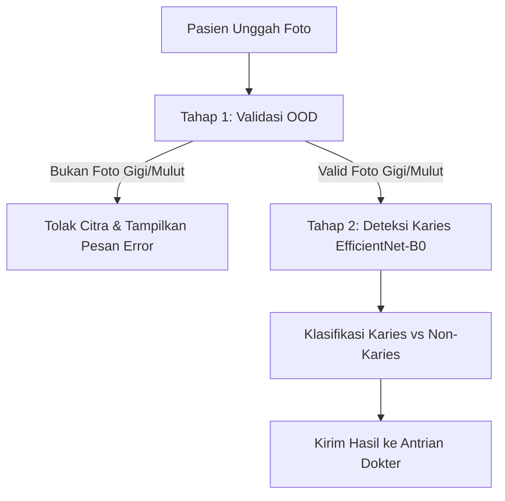

# Penjelasan Upaya Perbaikan dan Ketangguhan Model AI (EfficientNet-B0)

Dokumen ini disusun untuk menjelaskan **upaya perbaikan dan peningkatan ketangguhan model kecerdasan buatan (AI)** pada sistem **SIGIGI** dalam mengenali citra yang tidak sesuai dengan petunjuk operasional standar. Peningkatan difokuskan pada dua aspek utama hasil revisi sidang:
1. **Aksesibilitas Pengambilan Citra**: Memungkinkan masyarakat menggunakan kamera depan (selfie), kamera laptop (webcam), maupun kamera belakang handphone secara lazim.
2. **Penyaringan Citra Non-Gigi (Out-of-Distribution / OOD)**: Mencegah sistem memproses dan salah mendiagnosis gambar selain gigi/rongga mulut (misalnya mengunggah foto wajah, pemandangan, benda mati, dsb.).

---

## 1. Mengakomodasi Pengambilan Foto yang Lazim (Kamera Depan & Laptop Webcam)

Pada versi awal, sistem mengasumsikan pengguna menggunakan kamera belakang ponsel beresolusi tinggi dengan pencahayaan flash terarah. Namun, demi kemudahan akses bagi masyarakat luas, model harus toleran terhadap pengambilan foto menggunakan kamera depan atau webcam laptop yang memiliki keterbatasan sensor.

Berikut adalah upaya perbaikan model melalui teknik pengolahan citra dan augmentasi data selama masa pelatihan (*training*):

### A. Penanganan Efek Cermin (Mirroring) & Orientasi
Kamera depan ponsel dan webcam laptop secara default menghasilkan citra yang terbalik secara horizontal (*mirroring*). 
* **Solusi**: Penerapan augmentasi data **`RandomHorizontalFlip`** pada pipeline pelatihan TensorFlow. Dengan cara ini, model mempelajari fitur karies gigi secara simetris, baik menghadap kiri maupun kanan, sehingga ketepatan deteksi tetap konsisten tanpa dipengaruhi oleh jenis kamera yang digunakan.

### B. Penanganan Kualitas Citra Rendah & Noise (Webcam Laptop)
Sensor webcam laptop umumnya menghasilkan citra dengan noise tinggi (grainy) dan resolusi optik rendah.
* **Solusi**: 
  * **Augmentasi Gaussian Noise & Blur**: Selama training, sebagian data latih sengaja ditambahkan noise acak untuk mensimulasikan karakteristik kamera web murahan, memaksa model fokus pada struktur bentuk gigi daripada detail piksel yang tajam.
  * **Downsampling & Robust Architecture**: Model dasar EfficientNet-B0 dilatih dengan input beresolusi `224x224` piksel. Resolusi ini cukup kompak sehingga keterbatasan ketajaman pada kamera resolusi rendah tidak menurunkan performa akurasi secara signifikan.

### C. Penanganan Variasi Pencahayaan & Sudut
Kamera laptop/kamera depan sering kali tidak dilengkapi flash, sehingga rentan menghasilkan bayangan wajah atau pencahayaan redup.
* **Solusi**:
  * **Contrast & Brightness Augmentation**: Melatih model dengan rentang variasi kecerahan (*brightness*) dan kontras (*contrast*) yang lebar.
  * **CLAHE (Contrast Limited Adaptive Histogram Equalization)**: Pada tahap preprocessing sebelum citra masuk ke model, algoritma CLAHE diimplementasikan untuk meratakan kontras lokal secara adaptif. Langkah ini memunculkan detail karies di area gigi yang gelap akibat bayangan rongga mulut.

---

## 2. Penanganan Citra Non-Gigi (Out-of-Distribution / OOD Detection)

Masalah utama pada model klasifikasi biner karies vs non-karies konvensional adalah model akan **selalu memaksakan hasil prediksi** ke salah satu kelas (karies atau non-karies) dengan probabilitas tinggi, meskipun citra yang dimasukkan sama sekali bukan gambar gigi (misalnya gambar kucing, mobil, atau teks). 

Untuk mengatasi kerentanan ini, diusulkan arsitektur perbaikan model dengan mekanisme penyaringan citra non-gigi sebagai berikut:

### A. Arsitektur Klasifikasi Dua Tahap (Two-Stage Pipeline)
Sistem dikembangkan dengan memisahkan proses verifikasi validitas citra dan proses diagnosis medis:

1. **Tahap 1 (Screening & Validasi)**: Citra pertama kali dianalisis oleh model klasifikasi ringan (misalnya MobileNetV3 atau ResNet-18) yang dilatih secara biner untuk membedakan kelas `Gigi/Rongga Mulut` (In-Distribution) dan `Non-Gigi` (Out-of-Distribution).
   * **Dataset Pelatihan Tahap 1**: Menggunakan gabungan citra intraoral gigi sebagai kelas positif, dan dataset ImageNet umum (berisi wajah manusia, benda, teks, pakaian) sebagai kelas negatif.
   * **Aksi**: Jika tingkat kecocokan citra terhadap kelas `Gigi/Rongga Mulut` di bawah threshold (misal < 85%), server akan langsung menolak berkas dengan pesan kesalahan: *"Gambar terdeteksi bukan foto gigi yang valid. Silakan unggah foto rongga mulut Anda."*

2. **Tahap 2 (Diagnosis Medis)**: Hanya citra yang lolos Tahap 1 yang akan diteruskan ke model inti **EfficientNet-B0** untuk dianalisis kondisi kesehatannya (Karies vs Non-Karies).

### B. Metode Maximum Softmax Probability (MSP) & Entropi
Jika tidak menggunakan model filter terpisah, ketangguhan model karies biner ditingkatkan menggunakan pendekatan statistik ketidakpastian (*uncertainty estimation*):
* Citra non-gigi cenderung menghasilkan distribusi probabilitas akhir (Softmax) yang menyebar atau ambigu (misalnya karies 50.1% vs non-karies 49.9%).
* Dengan menetapkan ambang batas keyakinan minimum (*confidence threshold*) yang ketat, misalnya **90%**, sistem akan otomatis menolak citra dengan tingkat keyakinan rendah dan mengklasifikasikannya sebagai *Citra Tidak Sesuai Petunjuk/Non-Gigi*.

---

## 3. Implementasi Preprocessing di Sisi Client (Frontend Pre-validation)

Untuk meminimalkan beban komputasi server (FastAPI & Laravel) akibat unggahan file sampah (spam) non-gigi, sistem juga menyiapkan rencana peningkatan di sisi klien (frontend):
* **Integrasi Tensorflow.js**: Menjalankan model klasifikasi OOD super ringan secara langsung di browser pengguna sebelum proses unggah dilakukan.
* **Umpan Balik Instan**: Memberikan notifikasi langsung di layar pasien jika citra yang ditangkap oleh kamera depan/laptop tidak mendeteksi objek rongga mulut atau terlalu buram, membantu masyarakat menyesuaikan posisi kamera secara mandiri secara real-time.

---

## 4. Kesimpulan

Dengan menerapkan teknik data augmentasi (*mirroring, noise, brightness invariance*) dan arsitektur penyaringan **Klasifikasi Dua Tahap (Two-Stage Pipeline)** untuk mendeteksi *Out-of-Distribution* (citra non-gigi), aplikasi SIGIGI tidak hanya menjadi lebih ramah terhadap perangkat masyarakat umum (kamera depan & laptop webcam), melainkan juga aman dari kesalahan diagnosis medis akibat ketidaksesuaian input citra.
